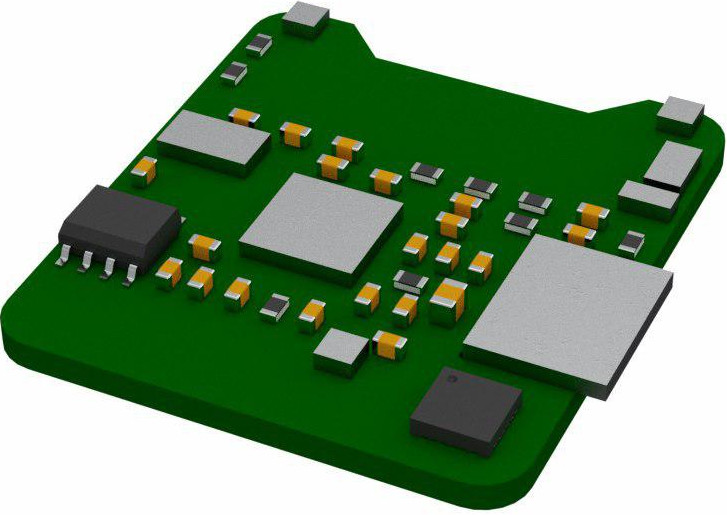
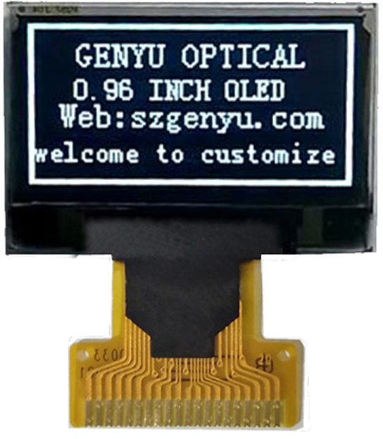
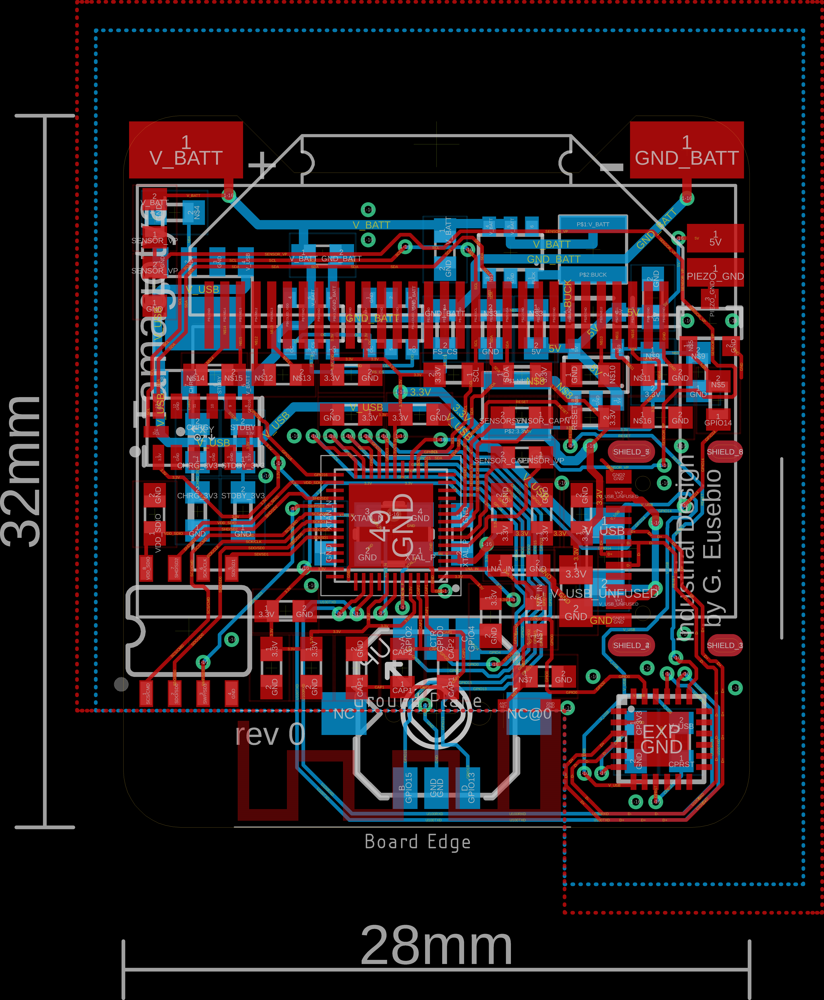
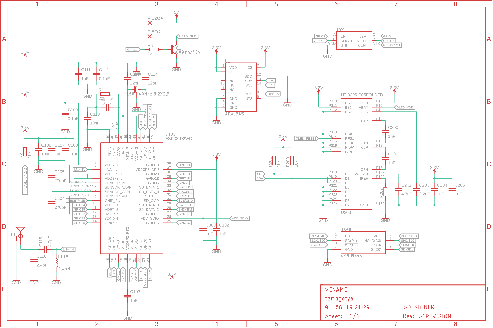
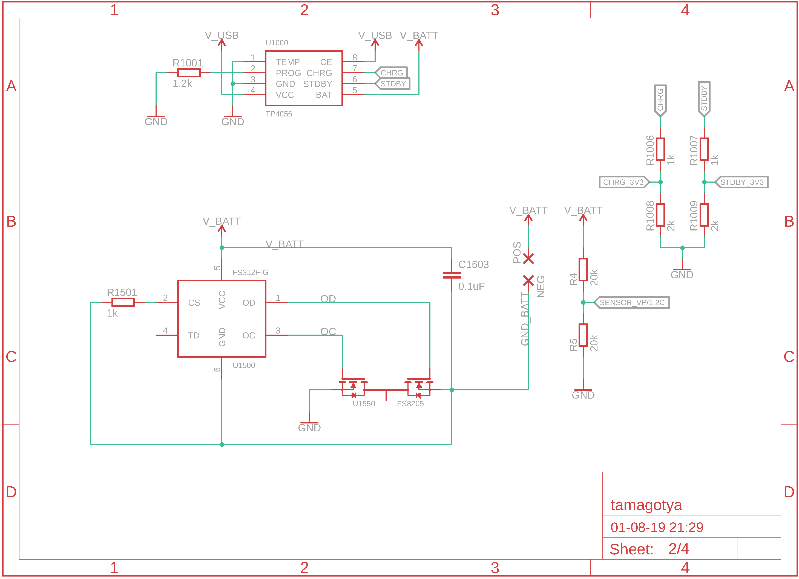
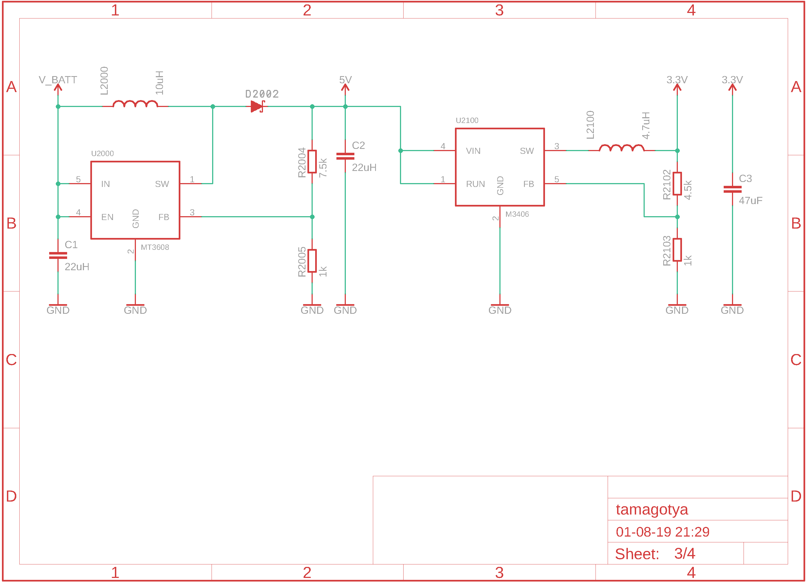
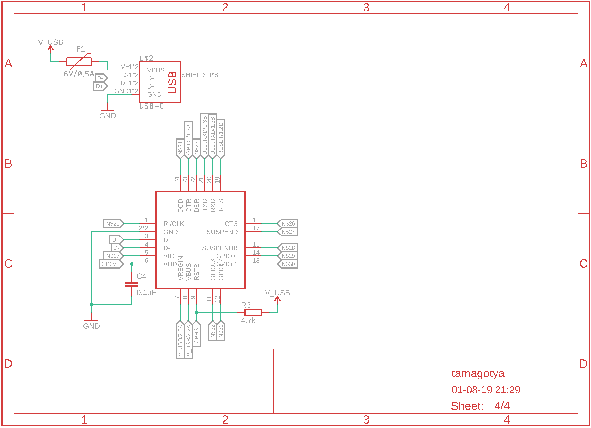

Tamagotchya
===========

A 2019 Tamagotchi clone using:
 * ESP 32 dual-core embedded wifi/bluetooth microcontroller
 * 4/8/16MB SPI flash on board
 * UT-0206-P05 monochrome oLED display
 * [ADXL345](References/ADXL345.pdf) Accellerometer
 * [USB C socket](References/XKB-U262-16XN-4BVC11_C319148.pdf) for charging and USB2.0 data
 * [CP2102N](References/SILICON-LABS-CP2102N-A01-GQFN20_C89049.pdf) Silicon Labs USB UART for interaction with a PCB 
 (and firmware loading)
 * [5 direction joypad](References/SF303GJ26-3.pdf) Up/Down/Left/Right/Click 
 * [TP4056](References/TP4056.pdf) 1A lithium battery charger for 300mAh-ish li-poly cell
 * [FS312](References/FS312.pdf) Battery over/under discharge protection, battery level monitoring using voltage divider and ESP's analog input.
 
## Render

Render is of rear of device. Clearance at top of board is for solder-down connector of this oLED LCD, bent over and folded over the PCB:

## PCB

## Schematics

## License
This project is licensed under the The TAPR Open Hardware License.

